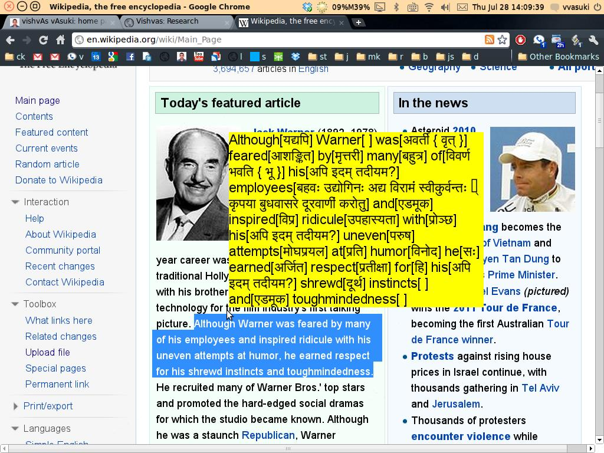

## Intro
- Sanskrit vocabulary builder. \[A prototype.\]

## Installation:  

Installation is very simple: To install and to look at the source code, please visit the [userscripts page](http://userscripts.org/scripts/show/108522) (a copy on this website is available [here](vocabularyBuilder.user.js)).

## Description:  

This user script looks up Sanskrit equivalents of words in selected text from the online dictionary spokensanskrit.de and presents these in a tooltip. Please see the screen-shot below.

  

## Limitations:

This is only a prototype. The script will be improved as time permits, hopefully with help from those who operate spokensanskrit.de.

- This script currently only works with google chrome, but some future version, I hope that it will work with all modern browsers.
- Clearly, dictionary look-up is not accurate. This will be fixed in the future.  
    

